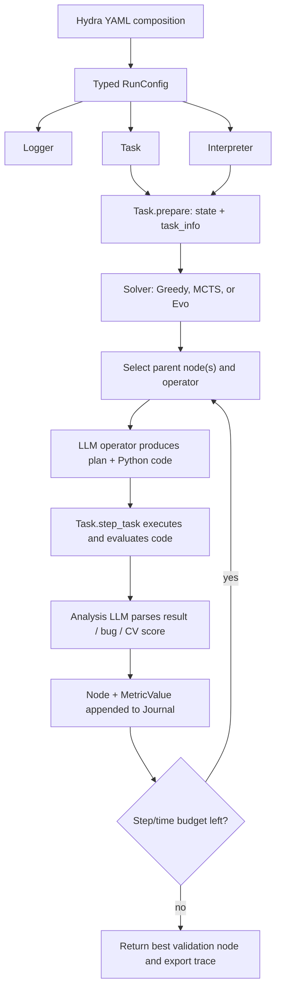

# How AIRA-dojo is implemented

This guide describes the local checkout at commit
`c795d8649d30b77fa9b8c011b978bba7127507ad` (2025-09-26). It is grounded in
the code, the [AIRA paper](https://arxiv.org/html/2507.02554v2), and the first
stage of [the three-paper proposal](../../three_paper_proposal_adaptive_search.pdf).

## The most important distinction

**Dojo is the experimental framework. AIRA is not a fourth solver class.**

In this repository, an AIRA agent is assembled from:

1. the Dojo runtime;
2. one search implementation: `Greedy`, `MCTS`, or `Evolutionary`;
3. a configured collection of LLM operators and prompts, usually called the
   AIRA operator family;
4. a task, currently MLE-bench in the stock registry; and
5. an interpreter, either a local Python worker or an Apptainer/Jupyter
   environment.

There is no `class AIRA`. The closest concrete example is
[`configs/solver/mlebench/greedy.yaml`](../src/dojo/configs/solver/mlebench/greedy.yaml):
it composes the generic Greedy solver with AIRA draft/debug/improve prompts and
the AIDE analysis prompt.

The small `aira_core` package is also not the agent. It supplies the base
configuration validation and hashing machinery.

## The paper's formalism and the code

The paper represents a research agent as

\[
(\mathcal F, \pi_{sel}, \mathcal O, \pi_{op}, \tau).
\]

The local implementation has all of these concepts, but not as five separate
interfaces:

| Formal component | Meaning | Local implementation |
|---|---|---|
| Search graph | Candidate artifacts and transformations | `Node` and `Journal` in [`journal.py`](../src/dojo/core/solvers/utils/journal.py) |
| `F` | Proxy fitness of a candidate | Task feedback plus the analysis operator, stored as `node.metric` |
| `pi_sel` | Which existing node(s) to use | Entangled inside each solver's search loop |
| `O` | Selectable candidate transformations: Draft, Improve, Debug, and (in Evolutionary) Crossover | Prompt/data builders in [`operators/`](../src/dojo/core/solvers/operators/) plus configured `GenericLLM` instances |
| `pi_op` | Which operator to apply | Also entangled inside each solver |
| `tau` | When to stop | Solver-specific step and wall-clock checks |

This mismatch is central to the proposed research. The proposal wants to vary
`pi_sel` and `pi_op` independently, but the current solver classes choose both
together. A clean adapter or refactor is therefore required before a controlled
adaptive-policy comparison.

## One run, end to end



The single-run entry point is
[`main_run.py`](../src/dojo/main_run.py):

1. Hydra composes `default_run.yaml` with task, solver, interpreter, logger, and
   metadata groups.
2. The `_target_` fields instantiate **configuration dataclasses**.
3. `build()` uses the dataclass name to find a runtime class in a hard-coded
   registry.
4. `task.prepare()` returns mutable environment state and the task information
   used to initialize the solver.
5. The solver creates a synthetic root and iterates until its budget ends.
6. The best valid Journal node is returned.

The runtime registries are currently static:

- tasks: [`config_dataclasses/task/__init__.py`](../src/dojo/config_dataclasses/task/__init__.py);
- solvers: [`config_dataclasses/solver/__init__.py`](../src/dojo/config_dataclasses/solver/__init__.py);
- interpreters: [`config_dataclasses/interpreter/__init__.py`](../src/dojo/config_dataclasses/interpreter/__init__.py).

## Configuration: what Hydra actually does

[`default_run.yaml`](../src/dojo/configs/default_run.yaml) requires three config
groups: `task`, `solver`, and `interpreter`. An experiment file under
`configs/_exp/` selects concrete variants and applies overrides.

For example, `+_exp=run_example` selects:

- Jupyter/Apptainer as the interpreter;
- MLE-bench Greedy as the solver;
- one MLE-bench competition as the task; and
- particular LLM clients for each operator.

An easy source of confusion is `_target_`. For example, a solver YAML points to
`GreedySolverConfig`, not directly to `Greedy`. After Hydra constructs the
dataclass, `build(cfg.solver, SOLVER_MAP, ...)` maps that dataclass type to the
runtime solver.

## Task and evaluator contract

The abstract task interface is in
[`core/tasks/base.py`](../src/dojo/core/tasks/base.py). A task supplies:

- `prepare(...) -> (state, task_info)`;
- `step_task(state, action) -> (state, outcome)`;
- `evaluate_fitness(...)`; and
- `close(state)`.

In practice, every stock solver expects `task_info` to include:

- `task_description`;
- `lower_is_better`.

Every outcome must include `execution_output`. It may also include:

- `validation_fitness`;
- `valid_solution`;
- `valid_solution_feedback`;
- `aux_eval_info`.

These keys are defined in
[`core/tasks/constants.py`](../src/dojo/core/tasks/constants.py).

### What the MLE-bench task does

[`tasks/mlebench/task.py`](../src/dojo/tasks/mlebench/task.py) loads the
competition description and data registry, sends generated Python code to the
interpreter, checks that the code created `submission.csv`, and grades that file
against private answers.

There are two distinct scores:

1. **Online proxy score:** normally the CV score printed by candidate code and
   extracted by the analysis LLM. This becomes `node.metric.value` and guides
   search.
2. **Private test score:** the MLE-bench grader evaluates every valid
   submission and places the report in `node.metric.info`, including a `score`
   field.

`use_test_score=False` prevents the solver from deliberately replacing the
online metric with the private score, but it does **not** remove that private
score from `metric.info`. Future policy code must therefore use an explicit
online-feature allowlist and never inspect `node.metric.info` during a run.

## Interpreters

The common return type is `ExecutionResult`: terminal output, elapsed time,
exit code, optional return value, and timeout status.

### Python interpreter

[`core/interpreters/python.py`](../src/dojo/core/interpreters/python.py) runs
candidate Python code in a child process, redirects stdout/stderr, enforces a
timeout, and can return a value stored by the candidate in `__result__`.

It is useful for local development but is process separation, not a security
sandbox. Candidate code still runs with the user's permissions.

### Jupyter/Apptainer interpreter

The Jupyter implementation launches an Apptainer-backed Jupyter Kernel Gateway.
It is the research-scale isolation path: data can be mounted read-only, GPU/CPU
resources are controlled, and runs receive isolated filesystems. It assumes a
Linux/HPC-style environment and is not the simplest path for a local macOS
smoke test.

## Operators: where AIRA behavior lives

Each solver's `setup_operators()` creates one `GenericLLM` per configured
operator and binds it to a thin Python function with `functools.partial`.
`GenericLLM` renders a Jinja prompt, calls a configured backend, and returns the
completion plus prompt/token/latency metadata.

The generative operators are:

- **Draft:** propose a new plan and full solution from the root.
- **Improve:** transform one valid parent into a new candidate.
- **Debug:** repair one buggy candidate using its code and execution output.
- **Crossover:** combine two valid parents; only Evolutionary wires it today.

Two supporting operations are easy to misclassify:

- **Analysis** is an LLM call made after execution to identify failure, summarize
  output, and extract the candidate's validation metric. It is overhead paid by
  every candidate, not currently a selectable search arm.
- **Memory** is a handcrafted Journal-to-prompt renderer. It can expose global,
  sibling, or ancestral history. It does not create a search node.

`execute_op_plan_code()` centralizes completion parsing and retries up to
`max_operator_tries`; after exhausting those attempts it may still return no
extracted code.

### AIRA prompts versus AIDE prompts

The operator family is selected by YAML, not by the solver class. This makes it
possible to combine AIRA prompts with Greedy/MCTS/Evolutionary search and AIDE
prompts with Greedy.

The AIRA paper describes prompt-adaptive complexity, sibling-scoped memory for
draft/improve, ancestral debug memory, and hidden think-token handling. The
local checkout predates paper v2 and should not be assumed to reproduce every
published setting: its stock MLE configs set `use_complexity: false` and load
`simple_memory` for normal operators. Always save the fully resolved config in
an experiment and report the commit hash.

The stock AIRA prompt YAMLs are also intentionally MLE-specific: they mention
Kaggle, 5-fold CV, `submission.csv`, and H200 hardware. They should not be used
unchanged for a non-ML toy task.

## Search graph: `Node`, `MetricValue`, and `Journal`

A `Node` contains:

- generated plan and code;
- parent and child links;
- creation step and timestamp;
- operator names and their call metadata;
- terminal output, exit code, and execution time;
- analysis summary, metric, and bug status.

`MetricValue` changes comparison semantics so that “greater” always means
“better,” even for a lower-is-better task. `Journal.get_best_node()` can
therefore use `max()` for both accuracy and loss-like metrics.

`Journal` assigns step numbers, exposes good/buggy/draft pools, serializes node
records, and reconstructs parent-child links. Crossover gives a node two
parents, so the structure is more accurately a directed acyclic graph than a
tree.

## The three implemented searches

### Greedy

The local Greedy policy is:

1. Draft until `num_drafts` candidates exist.
2. With probability `debug_prob`, choose a random buggy leaf within the debug
   depth limit.
3. Otherwise choose the globally best valid node by validation metric and
   improve it.
4. If there is no valid node, draft again.

Its `search_policy()` returns only a node or `None`. The subsequent `step()`
infers the operator:

- `None` -> draft;
- buggy node -> debug;
- valid node -> improve.

This is why overriding `search_policy()` alone cannot implement an arbitrary
operator policy.

### MCTS

The implementation is rollout-free MCTS:

1. descend from the root to a leaf using UCT;
2. create up to `num_children` real candidates at that leaf;
3. use Draft at the root and Improve below the root;
4. evaluate each candidate directly with the task fitness proxy;
5. enter an automatic Debug chain when a candidate fails; and
6. backpropagate successful leaf scores and visit counts.

There is no simulated/default rollout. Debug is reactive, not independently
selected by UCT.

### Evolutionary

The evolutionary solver maintains one or more islands:

1. generation 0 drafts the initial population;
2. later generations sample an island and fitness-weighted parent(s);
3. one parent triggers Improve, while two parents trigger Crossover;
4. buggy children enter a Debug chain;
5. accepted children join an island when they meet its average-fitness rule;
6. oversized islands drop weak members, with optional migration/reset.

The temperature schedule can shift the sampling distribution over generations
when its endpoints differ. In the stock MLE configuration, both endpoints are
`1.0`, so there is no shift.

The config field named `few_shot` is effectively the number of parent nodes
sampled for Improve or Crossover, not ordinary prompt few-shot examples.

## Logging and artifacts

The solvers log nodes under the `JOURNAL` namespace. Greedy additionally logs
solver state under `STATE`; MCTS and Evolutionary do not emit that record in
their current step loops. With local JSON logging enabled, data is buffered
into JSONL files.
At the end of a run, `SearchExporter` can write:

- a JSON search record containing nodes, config, and best solution;
- an interactive HTML graph visualization.

The node record is already a useful starting point for Phase 0: code, graph
edges, validation metric, private report metadata, terminal output, timestamps,
execution time, and operator-call metadata are present.

It is not yet a sufficient policy-learning trace. It lacks action masks,
candidate actions, policy scores/probabilities, selected parent rationale,
budget phase, cumulative cost, and post-action reward. Those should be emitted
as a separate `POLICY` JSONL stream keyed by node ID and step.

## Important limitations in this checkout

These are engineering findings, not theoretical objections:

1. **The generic entry point is MLE-specific.** `main_run.py` imports
   `mlebench` unconditionally and its final path requires
   `best_node.metric.info["score"]` instead of calling the task's
   `evaluate_fitness()`.
2. **The registries are hard-coded.** A new task or solver needs both a config
   dataclass and a registry edit.
3. **The analyzer is effectively mandatory.** Even if a task provides
   `validation_fitness`, the solver calls the analysis LLM first; an analysis
   failure can leave an otherwise valid candidate marked buggy.
4. **Run seeds are not applied.** `metadata.seed` is used in experiment
   metadata, but the run does not seed Python, NumPy, or Torch.
5. **MCTS can spin at the limit.** Its outer loop uses `<=` while expansion
   creates zero children when no steps remain. Use `<` before running a study.
6. **Checkpoint resume is not exact.** Solvers recreate a root after loading;
   MCTS visit/value state and node type are not exported; Evolutionary omits
   population state and current generation.
7. **Evolutionary budget and island bookkeeping need tests.** It can overshoot
   the step limit within a generation, failed candidates can misalign island
   IDs, and the reset ordering appears to reset the stronger half.
8. **The base MCTS YAML names a nonexistent config class.** The MLE overlay
   corrects it, but the generic file alone does not compose.
9. **README command labels are swapped.** Around the baseline examples,
   AIRA/AIDE Greedy and MCTS/Evolutionary comments do not match command names.
10. **The source tree has no maintained test suite.** An embedded exporter test
    references removed `Node` fields.
11. **A clean install may miss `black`.** Core code parsing imports it, but it
    is not directly declared in `requirements.txt`.

Treat the existing checkpoint files as debug snapshots until fresh-run versus
resume equivalence is covered by tests.

## The included non-ML microscope

[`examples/toy_search_demo.py`](../examples/toy_search_demo.py) uses a hidden
bit-string objective. A candidate's score is simply the fraction of correct
bits. It has natural draft, improve, debug, and crossover operations.

Dependency-free comparison:

```bash
python3 examples/toy_search_demo.py \
  --engine lightweight \
  --methods greedy,mcts,evolutionary \
  --bits 20 \
  --budget 40 \
  --seed 7 \
  --output-dir toy_runs
```

Real Dojo solver-loop smoke test with deterministic, zero-API operators:

```bash
conda activate aira-dojo
pip install -e .
# Required by core parsing in this checkout but absent from requirements.txt:
pip install black
PYTHONPATH=src python3 examples/toy_search_demo.py \
  --engine dojo \
  --methods greedy,mcts,evolutionary \
  --bits 20 \
  --budget 40 \
  --seed 7 \
  --output-dir toy_runs
```

The `dojo` engine bypasses `main_run.py` because of its MLE-specific assumptions.
It exercises the actual solver loops, Node/Journal, result parser,
parent-child relationships, UCT backup, and evolutionary population logic. The
demo supplies a toy task/interpreter and deterministic operators, disables
checkpoint/export side effects, and patches the MCTS terminal-loop bug. It is a
framework smoke test, not a complete production run with only the LLM swapped.

The demo normalizes its own `--budget` to root-excluded candidate evaluations:
it adds one to the root-inclusive solver limit and enforces a task-side hard cap
to stop Evolutionary's partial final generation. This makes the toy traces
comparable by evaluation count, but it does **not** repair budget accounting in
ordinary repository runs; Phase 0 still needs a common counter in the
framework. UUIDs, timestamps, and MCTS set traversal also mean that seeded
operators alone do not make full Dojo JSON traces byte-identical.

Run built-in checks with:

```bash
python3 examples/toy_search_demo.py --self-test
```

This built-in test covers the lightweight engine. The explicit `--engine dojo`
command above is the real-Dojo smoke test.

## Suggested code-reading order

1. [`main_run.py`](../src/dojo/main_run.py)
2. [`core/tasks/base.py`](../src/dojo/core/tasks/base.py)
3. [`core/solvers/base.py`](../src/dojo/core/solvers/base.py)
4. [`journal.py`](../src/dojo/core/solvers/utils/journal.py)
5. [`greedy.py`](../src/dojo/solvers/greedy/greedy.py)
6. [`mcts.py`](../src/dojo/solvers/mcts/mcts.py)
7. [`evo.py`](../src/dojo/solvers/evo/evo.py)
8. [`tasks/mlebench/task.py`](../src/dojo/tasks/mlebench/task.py)
9. [`core/interpreters/python.py`](../src/dojo/core/interpreters/python.py)
10. the YAMLs under `configs/solver/` and `configs/_exp/`

That sequence follows the runtime from composition to search, evaluation, and
artifacts without getting lost in prompt text first.
